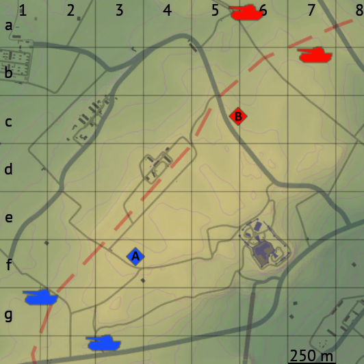
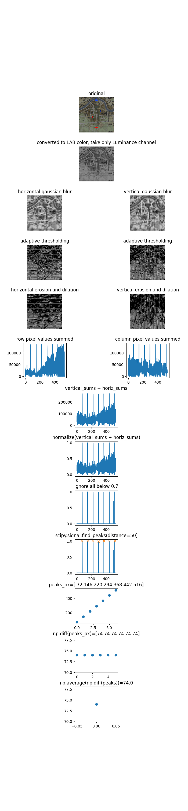
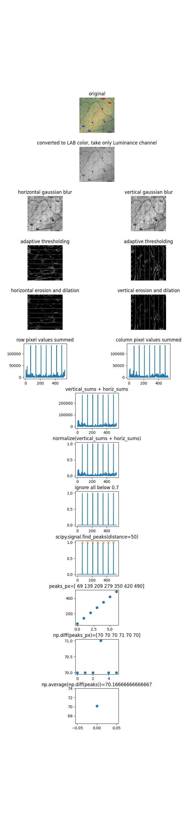

# war-thunder-map-image-grid-extractor

Extract War Thunder map image, map name, grid size (meters) and grid size (in pixels) from the custom match maplist.

## Installing

1. Install Python 3.11 or later
2. Install pip (pip3) if you don't have it
3. Activate the venv
   - Linux/macOS: `.venv/Scripts/activate`
   - Windows: `.venv\Scripts\activate.bat` or `.venv\Scripts\activate.ps1` on cmd.exe or Powershell respectively
4. Install the pip requirements
   1. `pip install -r requirements.txt`
5. Install [tesserocr](https://github.com/sirfz/tesserocr) 2.5.2 with pip
   - Linux/macOS: follow the instructions in the README
   - Windows: download the 2.5.2 .whl file from the GitHub releases page and `pip install <package>.whl`
6. Download [eng.traineddata](https://github.com/tesseract-ocr/tessdata_best/blob/main/eng.traineddata) Tesseract OCR data file and save it into this directory

## Running

1. Dump all your 2560x1440 screenshots of the map list into `images_source`. Name does not matter, just make sure they're .png or alternatively change the file extension filter in `crop_maps_and_ocr_name_and_gridsize.py`
2. Run `python crop_maps_and_ocr_name_and_gridsize.py`
   - will dump a json-ish array of arrays of the map name and the detected grid size text from the bottom right of the map image
   - will also write the map images to `output_maps/`
3. Fix any typos in the written map names (e.g. `Hiirtgen` -> `Hürtgen`)
4. Run `python detect_grid_pixel_sizes.py`
   - will dump a json-ish array of arrays of the map name and the detected grid pixel size

## Output example

### crop_maps_and_ocr_name_and_gridsize.py

#### stdout

[mapImageName, gridSizeInMeters]

```json
[
  ["[Battle #1] Fulda", "250m"],
  ["[Battle #1] Golden Quarry", "225m"],
  ["[Battle #1] Maginot Line (winter)", "250m"],
  ["[Battle #1] Maginot Line", "250m"],
  ["[Battle #1] Vietnam", "250m"],
  ["[Battle #2] Fulda", "550m"]
  /* ... */
]
```

#### Images

- Cropped map images
  - 
- Debug image of the grid meter size that's OCR'd
  - 

### detect_grid_pixel_sizes.py

#### stdout

[mapImageName, gridSizeInPixels]

```json
[
  ["[Battle #1] Fulda", 70.17],
  ["[Battle #1] Golden Quarry", 75.0],
  ["[Battle #1] Maginot Line (winter)", 70.17],
  ["[Battle #1] Maginot Line", 70.17],
  ["[Battle #1] Vietnam", 70.17],
  ["[Battle #2] Fulda", 73.33]
  /* ... */
]
```

#### Images

- Debug images of how the algorithm works

> 

> 
